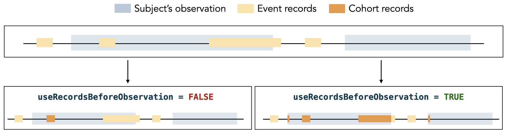

# Building base cohorts

## Introduction

Let’s first create a cdm reference to the Eunomia synthetic data.

``` r
library(omock)
library(CodelistGenerator)
library(PatientProfiles)
library(CohortConstructor)
library(dplyr)
library(CDMConnector)
library(duckdb)

cdm <- mockCdmFromDataset(datasetName = "GiBleed", source = "duckdb")
```

## Concept based cohort creation

A way of defining base cohorts is to identify clinical records with
codes from some pre-specified concept list. Here for example we’ll first
find codes for diclofenac and acetaminophen. We use the
[`getDrugIngredientCodes()`](https://darwin-eu.github.io/CodelistGenerator/reference/getDrugIngredientCodes.html)
function from the package **CodelistGenerator** to obtain the codes for
these drugs.

``` r
drug_codes <- getDrugIngredientCodes(cdm, 
                                     name = c("acetaminophen",
                                              "amoxicillin", 
                                              "diclofenac", 
                                              "simvastatin",
                                              "warfarin"))

drug_codes
#> 
#> - 11289_warfarin (2 codes)
#> - 161_acetaminophen (7 codes)
#> - 3355_diclofenac (1 codes)
#> - 36567_simvastatin (2 codes)
#> - 723_amoxicillin (4 codes)
```

Now we have our codes of interest, we’ll make cohorts for each of these
where cohort exit is defined as the event start date (which for these
will be their drug exposure end date).

``` r
cdm$drugs <- conceptCohort(cdm, 
                           conceptSet = drug_codes,
                           exit = "event_end_date",
                           name = "drugs")

settings(cdm$drugs)
#> # A tibble: 5 × 4
#>   cohort_definition_id cohort_name       cdm_version vocabulary_version
#>                  <int> <chr>             <chr>       <chr>             
#> 1                    1 11289_warfarin    5.3         v5.0 18-JAN-19    
#> 2                    2 161_acetaminophen 5.3         v5.0 18-JAN-19    
#> 3                    3 3355_diclofenac   5.3         v5.0 18-JAN-19    
#> 4                    4 36567_simvastatin 5.3         v5.0 18-JAN-19    
#> 5                    5 723_amoxicillin   5.3         v5.0 18-JAN-19
cohortCount(cdm$drugs)
#> # A tibble: 5 × 3
#>   cohort_definition_id number_records number_subjects
#>                  <int>          <int>           <int>
#> 1                    1            137             137
#> 2                    2          13908            2679
#> 3                    3            830             830
#> 4                    4            182             182
#> 5                    5           4307            2130
attrition(cdm$drugs)
#> # A tibble: 20 × 7
#>    cohort_definition_id number_records number_subjects reason_id reason         
#>                   <int>          <int>           <int>     <int> <chr>          
#>  1                    1            137             137         1 Initial qualif…
#>  2                    1            137             137         2 Record in obse…
#>  3                    1            137             137         3 Not missing re…
#>  4                    1            137             137         4 Merge overlapp…
#>  5                    2          14205            2679         1 Initial qualif…
#>  6                    2          14205            2679         2 Record in obse…
#>  7                    2          14205            2679         3 Not missing re…
#>  8                    2          13908            2679         4 Merge overlapp…
#>  9                    3            850             850         1 Initial qualif…
#> 10                    3            830             830         2 Record in obse…
#> 11                    3            830             830         3 Not missing re…
#> 12                    3            830             830         4 Merge overlapp…
#> 13                    4            182             182         1 Initial qualif…
#> 14                    4            182             182         2 Record in obse…
#> 15                    4            182             182         3 Not missing re…
#> 16                    4            182             182         4 Merge overlapp…
#> 17                    5           4309            2130         1 Initial qualif…
#> 18                    5           4309            2130         2 Record in obse…
#> 19                    5           4309            2130         3 Not missing re…
#> 20                    5           4307            2130         4 Merge overlapp…
#> # ℹ 2 more variables: excluded_records <int>, excluded_subjects <int>
```

This creates a cohort where individuals are defined by their exposure to
the specified drugs, and their cohort duration is determined by the
exposure end date.

Next, let’s create a cohort for individuals with bronchitis. We define a
set of codes representing bronchitis and use the
[`conceptCohort()`](https://ohdsi.github.io/CohortConstructor/reference/conceptCohort.md)
function to create the cohort. Here, the cohort exit is defined by the
event start date (i.e., `event_start_date`). We set
`table = "condition_occurrence"` so that the records for the provided
concepts will be searched only in the *condition_occurrence* table. We
then set `subsetCohort = "drugs"` to restrict the cohort creation to
individuals already in the `drugs` cohort. Additionally, we use
`subsetCohortId = 1` to include only subjects from the cohort 1 (which
corresponds to individuals who have been exposed to warfarin).

``` r

bronchitis_codes <- list(bronchitis = c(260139, 256451, 4232302))

cdm$bronchitis <- conceptCohort(cdm, 
                           conceptSet = bronchitis_codes,
                           exit = "event_start_date",
                           name = "bronchitis",
                           table = "condition_occurrence", 
                           subsetCohort = "drugs", 
                           subsetCohortId = 1
                           )


cohortCount(cdm$bronchitis)
#> # A tibble: 1 × 3
#>   cohort_definition_id number_records number_subjects
#>                  <int>          <int>           <int>
#> 1                    1            533             130
attrition(cdm$bronchitis)
#> # A tibble: 4 × 7
#>   cohort_definition_id number_records number_subjects reason_id reason          
#>                  <int>          <int>           <int>     <int> <chr>           
#> 1                    1            533             130         1 Initial qualify…
#> 2                    1            533             130         2 Record in obser…
#> 3                    1            533             130         3 Not missing rec…
#> 4                    1            533             130         4 Drop duplicate …
#> # ℹ 2 more variables: excluded_records <int>, excluded_subjects <int>
```

When some records in the cohort overlap, the cohort start date will be
set to the earliest start date. If we set `overlap = "merge"`, the
cohort end date will be set to the latest end date of the overlapping
records.

``` r
cdm$drugs_merge <- conceptCohort(cdm, 
                           conceptSet = drug_codes,
                           overlap = "merge",
                           name = "drugs_merge")

cdm$drugs_merge |>
  attrition()
#> # A tibble: 20 × 7
#>    cohort_definition_id number_records number_subjects reason_id reason         
#>                   <int>          <int>           <int>     <int> <chr>          
#>  1                    1            137             137         1 Initial qualif…
#>  2                    1            137             137         2 Record in obse…
#>  3                    1            137             137         3 Not missing re…
#>  4                    1            137             137         4 Merge overlapp…
#>  5                    2          14205            2679         1 Initial qualif…
#>  6                    2          14205            2679         2 Record in obse…
#>  7                    2          14205            2679         3 Not missing re…
#>  8                    2          13908            2679         4 Merge overlapp…
#>  9                    3            850             850         1 Initial qualif…
#> 10                    3            830             830         2 Record in obse…
#> 11                    3            830             830         3 Not missing re…
#> 12                    3            830             830         4 Merge overlapp…
#> 13                    4            182             182         1 Initial qualif…
#> 14                    4            182             182         2 Record in obse…
#> 15                    4            182             182         3 Not missing re…
#> 16                    4            182             182         4 Merge overlapp…
#> 17                    5           4309            2130         1 Initial qualif…
#> 18                    5           4309            2130         2 Record in obse…
#> 19                    5           4309            2130         3 Not missing re…
#> 20                    5           4307            2130         4 Merge overlapp…
#> # ℹ 2 more variables: excluded_records <int>, excluded_subjects <int>
```

Alternatively, if we set `overlap = "extend"`, the cohort end date will
be extended by summing the durations of each overlapping record, as
depicted in the image below.


``` r
cdm$drugs_extend <- conceptCohort(cdm, 
                           conceptSet = drug_codes,
                           overlap = "extend",
                           name = "drugs_extend")

cdm$drugs_extend |>
  attrition()
#> # A tibble: 30 × 7
#>    cohort_definition_id number_records number_subjects reason_id reason         
#>                   <int>          <int>           <int>     <int> <chr>          
#>  1                    1            137             137         1 Initial qualif…
#>  2                    1            137             137         2 Record in obse…
#>  3                    1            137             137         3 Not missing re…
#>  4                    1            137             137         4 Add overlappin…
#>  5                    1            137             137         5 Record in obse…
#>  6                    1            137             137         6 Not missing re…
#>  7                    2          14205            2679         1 Initial qualif…
#>  8                    2          14205            2679         2 Record in obse…
#>  9                    2          14205            2679         3 Not missing re…
#> 10                    2          13905            2679         4 Add overlappin…
#> # ℹ 20 more rows
#> # ℹ 2 more variables: excluded_records <int>, excluded_subjects <int>
```

To create a cohort from a concept set and include records outside the
observation period, we can set `useRecordsBeforeObservation = TRUE`.
This option shifts records that start before the observation period to
the start of the corresponding observation period, and trims records
that start or end after the observation period so they fall within that
observation period. This behavior is shown in the image below.



If we also want to search for the given concepts in the source
concept_id fields, rather than only the standard concept_id fields, we
can set `useSourceFields = TRUE`.

``` r

cdm$celecoxib <- conceptCohort(cdm, 
                           conceptSet = list(celecoxib = 44923712),
                           name = "celecoxib", 
                           useRecordsBeforeObservation = TRUE, 
                           useSourceFields = TRUE)
cdm$celecoxib |>
  glimpse()
#> Rows: ??
#> Columns: 4
#> Database: DuckDB 1.4.3 [unknown@Linux 6.11.0-1018-azure:R 4.5.2//tmp/Rtmpc4xgp4/file25d0f6b1795.duckdb]
#> $ cohort_definition_id <int> 1, 1, 1, 1, 1, 1, 1, 1, 1, 1, 1, 1, 1, 1, 1, 1, 1…
#> $ subject_id           <int> 795, 820, 962, 1635, 2960, 3149, 4498, 196, 951, …
#> $ cohort_start_date    <date> 1982-08-23, 2004-12-27, 1995-04-18, 2012-02-21, …
#> $ cohort_end_date      <date> 1982-08-23, 2004-12-27, 1995-04-18, 2012-02-21, …
```

## Demographic based cohort creation

One base cohort we can create is based around patient demographics. Here
for example we create a cohort where people enter on their 18th birthday
and leave at on the day before their 66th birthday.

``` r
cdm$working_age_cohort <- demographicsCohort(cdm = cdm, 
                                             ageRange = c(18, 65), 
                                             name = "working_age_cohort")

settings(cdm$working_age_cohort)
#> # A tibble: 1 × 3
#>   cohort_definition_id cohort_name  age_range
#>                  <int> <chr>        <chr>    
#> 1                    1 demographics 18_65
cohortCount(cdm$working_age_cohort)
#> # A tibble: 1 × 3
#>   cohort_definition_id number_records number_subjects
#>                  <int>          <int>           <int>
#> 1                    1           2694            2694
attrition(cdm$working_age_cohort)
#> # A tibble: 3 × 7
#>   cohort_definition_id number_records number_subjects reason_id reason          
#>                  <int>          <int>           <int>     <int> <chr>           
#> 1                    1           2694            2694         1 Initial qualify…
#> 2                    1           2694            2694         2 Non-missing yea…
#> 3                    1           2694            2694         3 Age requirement…
#> # ℹ 2 more variables: excluded_records <int>, excluded_subjects <int>
```

We can also add an additional requirement of only people of working age
with sex “female”.

``` r
cdm$female_working_age_cohort <- demographicsCohort(cdm = cdm, 
                                             ageRange = c(18, 65),
                                             sex = "Female",
                                             name = "female_working_age_cohort")

settings(cdm$female_working_age_cohort)
#> # A tibble: 1 × 4
#>   cohort_definition_id cohort_name  age_range sex   
#>                  <int> <chr>        <chr>     <chr> 
#> 1                    1 demographics 18_65     Female
cohortCount(cdm$female_working_age_cohort)
#> # A tibble: 1 × 3
#>   cohort_definition_id number_records number_subjects
#>                  <int>          <int>           <int>
#> 1                    1           1373            1373
attrition(cdm$female_working_age_cohort)
#> # A tibble: 5 × 7
#>   cohort_definition_id number_records number_subjects reason_id reason          
#>                  <int>          <int>           <int>     <int> <chr>           
#> 1                    1           2694            2694         1 Initial qualify…
#> 2                    1           2694            2694         2 Non-missing sex 
#> 3                    1           1373            1373         3 Sex requirement…
#> 4                    1           1373            1373         4 Non-missing yea…
#> 5                    1           1373            1373         5 Age requirement…
#> # ℹ 2 more variables: excluded_records <int>, excluded_subjects <int>
```

We can also use this function to create cohorts for different
combinations of age groups and sex.

``` r
cdm$age_sex_cohorts <- demographicsCohort(cdm = cdm, 
                                             ageRange = list(c(0, 17), c(18, 65), c(66,120)),
                                             sex = c("Female", "Male"),
                                             name = "age_sex_cohorts")

settings(cdm$age_sex_cohorts)
#> # A tibble: 6 × 4
#>   cohort_definition_id cohort_name    age_range sex   
#>                  <int> <chr>          <chr>     <chr> 
#> 1                    1 demographics_1 0_17      Female
#> 2                    2 demographics_2 0_17      Male  
#> 3                    3 demographics_3 18_65     Female
#> 4                    4 demographics_4 18_65     Male  
#> 5                    5 demographics_5 66_120    Female
#> 6                    6 demographics_6 66_120    Male
cohortCount(cdm$age_sex_cohorts)
#> # A tibble: 6 × 3
#>   cohort_definition_id number_records number_subjects
#>                  <int>          <int>           <int>
#> 1                    1           1373            1373
#> 2                    2           1321            1321
#> 3                    3           1373            1373
#> 4                    4           1321            1321
#> 5                    5            393             393
#> 6                    6            378             378
attrition(cdm$age_sex_cohorts)
#> # A tibble: 30 × 7
#>    cohort_definition_id number_records number_subjects reason_id reason         
#>                   <int>          <int>           <int>     <int> <chr>          
#>  1                    1           2694            2694         1 Initial qualif…
#>  2                    1           2694            2694         2 Non-missing sex
#>  3                    1           1373            1373         3 Sex requiremen…
#>  4                    1           1373            1373         4 Non-missing ye…
#>  5                    1           1373            1373         5 Age requiremen…
#>  6                    2           2694            2694         1 Initial qualif…
#>  7                    2           2694            2694         2 Non-missing sex
#>  8                    2           1321            1321         3 Sex requiremen…
#>  9                    2           1321            1321         4 Non-missing ye…
#> 10                    2           1321            1321         5 Age requiremen…
#> # ℹ 20 more rows
#> # ℹ 2 more variables: excluded_records <int>, excluded_subjects <int>
```

We can also specify the minimum number of days of prior observation
required.

``` r
cdm$working_age_cohort_0_365 <- demographicsCohort(cdm = cdm, 
                                             ageRange = c(18, 65), 
                                             name = "working_age_cohort_0_365",
                                             minPriorObservation = c(0,365))

settings(cdm$working_age_cohort_0_365)
#> # A tibble: 2 × 4
#>   cohort_definition_id cohort_name    age_range min_prior_observation
#>                  <int> <chr>          <chr>                     <dbl>
#> 1                    1 demographics_1 18_65                         0
#> 2                    2 demographics_2 18_65                       365
cohortCount(cdm$working_age_cohort_0_365)
#> # A tibble: 2 × 3
#>   cohort_definition_id number_records number_subjects
#>                  <int>          <int>           <int>
#> 1                    1           2694            2694
#> 2                    2           2694            2694
attrition(cdm$working_age_cohort_0_365)
#> # A tibble: 8 × 7
#>   cohort_definition_id number_records number_subjects reason_id reason          
#>                  <int>          <int>           <int>     <int> <chr>           
#> 1                    1           2694            2694         1 Initial qualify…
#> 2                    1           2694            2694         2 Non-missing yea…
#> 3                    1           2694            2694         3 Age requirement…
#> 4                    1           2694            2694         4 Prior observati…
#> 5                    2           2694            2694         1 Initial qualify…
#> 6                    2           2694            2694         2 Non-missing yea…
#> 7                    2           2694            2694         3 Age requirement…
#> 8                    2           2694            2694         4 Prior observati…
#> # ℹ 2 more variables: excluded_records <int>, excluded_subjects <int>
```

## Measurement Cohort

Another base cohort we can create is based around patient measurements.
Here for example we create a cohort of patients who have a normal BMI
(BMI between 18 and 25), and a high BMI (BMI between 26 and 40). To do
this you must first identify the measurement you want to look at (in
this case BMI (concept id = 4245997)), the unit of measurement (kg per
square-meter (concept id = 9531)), the ‘normal’ value concept (concept
id = 4069590), and the concept for ‘overweight’ (concept id = 1990036).
The value concept is included for the cases where the exact BMI
measurement is not specified, but the BMI category (i.e. normal,
overweight, obese etc) is. This means that if a record matches the value
concept OR has a normal BMI score then it is included in the cohort.

``` r
cdm$cohort <- measurementCohort(
  cdm = cdm,
  name = "cohort",
  conceptSet = list("bmi" = c(4245997)),
  valueAsConcept = list("bmi_normal" = c(4069590), "bmi_overweight" = c(1990036)),
  valueAsNumber = list("bmi_normal" = list("9531" = c(18, 25)), "bmi_overweight" = list("9531" = c(26, 30)))
)

attrition(cdm$cohort)
#> # A tibble: 2 × 7
#>   cohort_definition_id number_records number_subjects reason_id reason          
#>                  <int>          <int>           <int>     <int> <chr>           
#> 1                    1              0               0         1 Initial qualify…
#> 2                    2              0               0         1 Initial qualify…
#> # ℹ 2 more variables: excluded_records <int>, excluded_subjects <int>
settings(cdm$cohort)
#> # A tibble: 2 × 4
#>   cohort_definition_id cohort_name    cdm_version vocabulary_version
#>                  <int> <chr>          <chr>       <chr>             
#> 1                    1 bmi_normal     5.3         mock              
#> 2                    2 bmi_overweight 5.3         mock
cdm$cohort
#> # Source:   table<cohort> [?? x 4]
#> # Database: DuckDB 1.4.3 [unknown@Linux 6.11.0-1018-azure:R 4.5.2/:memory:]
#> # ℹ 4 variables: cohort_definition_id <int>, subject_id <int>,
#> #   cohort_start_date <date>, cohort_end_date <date>
```

As you can see in the above code, the concept set is the list of BMI
concepts, for the “bmi_normal” cohort, the concept value is the ‘normal’
weight concept, and the values are the minimum and maximum BMI scores to
be considered. Similary for the “bmi_overweight”, the concept value
refers to “overweight” and the numeric range goes from minimum and
maximum BMI score for that category.

It is also possible to include records outside of observation by setting
the `useRecordsBeforeObservation` argument to TRUE.

``` r
cdm$cohort <- measurementCohort(
  cdm = cdm,
  name = "cohort",
  conceptSet = list("bmi" = c(4245997)),
  valueAsConcept = list("bmi_normal" = c(4069590)),
  valueAsNumber = list("bmi_normal" = list("9531" = c(18, 25))),
  useRecordsBeforeObservation = TRUE
)

attrition(cdm$cohort)
#> # A tibble: 1 × 7
#>   cohort_definition_id number_records number_subjects reason_id reason          
#>                  <int>          <int>           <int>     <int> <chr>           
#> 1                    1              0               0         1 Initial qualify…
#> # ℹ 2 more variables: excluded_records <int>, excluded_subjects <int>
settings(cdm$cohort)
#> # A tibble: 1 × 4
#>   cohort_definition_id cohort_name cdm_version vocabulary_version
#>                  <int> <chr>       <chr>       <chr>             
#> 1                    1 bmi_normal  5.3         mock
cdm$cohort
#> # Source:   table<cohort> [?? x 4]
#> # Database: DuckDB 1.4.3 [unknown@Linux 6.11.0-1018-azure:R 4.5.2/:memory:]
#> # ℹ 4 variables: cohort_definition_id <int>, subject_id <int>,
#> #   cohort_start_date <date>, cohort_end_date <date>
```

## Death cohort

Another base cohort we can make is one with individuals who have died.
For this we’ll simply be finding those people in the OMOP CDM death
table and creating a cohort with them.

``` r
cdm$death_cohort <- deathCohort(cdm = cdm,
                                name = "death_cohort")
```

To create a cohort of individuals who have died, but restrict it to
those already part of another cohort (e.g., the “drugs” cohort), you can
use `subsetCohort = "drugs"`. This ensures that only individuals from
the “drugs” cohort are included in the death cohort.

``` r
cdm$death_drugs <- deathCohort(cdm = cdm,
                               name = "death_drugs",
                               subsetCohort = "drugs")
```
