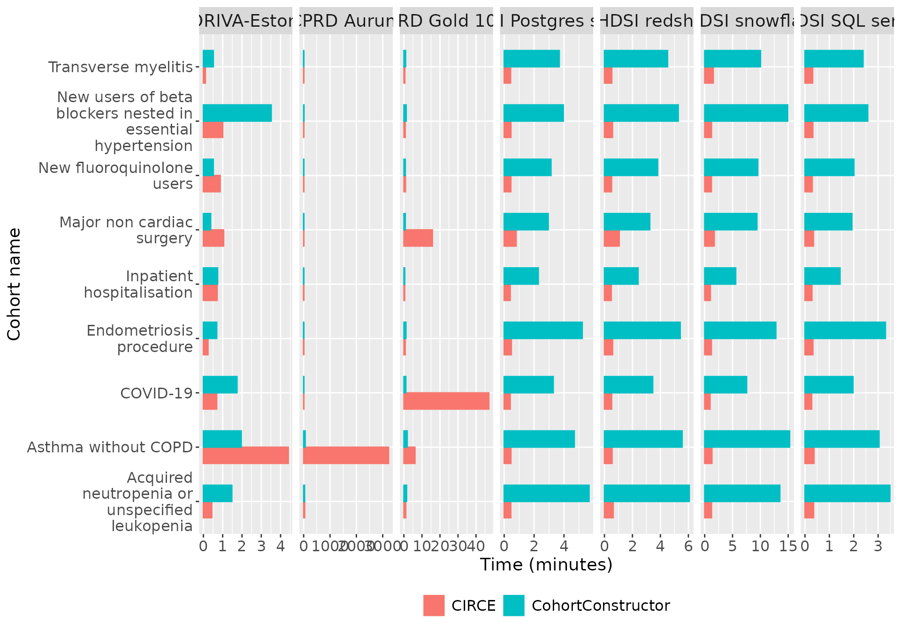

# CohortConstructor benchmarking results

## Introduction

Cohorts are a fundamental building block for studies that use the OMOP
CDM, identifying people who satisfy one or more inclusion criteria for a
duration of time based on their clinical records. Currently cohorts are
typically built using [CIRCE](https://github.com/OHDSI/circe-be) which
allows complex cohorts to be represented using JSON. This JSON is then
converted to SQL for execution against a database containing data mapped
to the OMOP CDM. CIRCE JSON can be created via the
[ATLAS](https://github.com/OHDSI/Atlas) GUI or programmatically via the
[Capr](https://github.com/OHDSI/Capr) R package. However, although a
powerful tool for expressing and operationalising cohort definitions,
the SQL generated can be cumbersome especially for complex cohort
definitions, moreover cohorts are instantiated independently, leading to
duplicated work.

The CohortConstructor package offers an alternative approach,
emphasising cohort building in a pipeline format. It first creates base
cohorts and then applies specific inclusion criteria. Unlike the “by
definition” approach, where cohorts are built independently,
CohortConstructor follows a “by domain/ table” approach, which minimises
redundant queries to large OMOP tables. More details on this approach
can be found in the [Introduction
vignette](https://ohdsi.github.io/CohortConstructor/articles/a00_introduction.html).

To test the performance of the package there is a benchmarking function
which uses nine phenotypes from the [OHDSI Phenotype
library](https://github.com/OHDSI/PhenotypeLibrary) that cover a range
of concept domains, entry and inclusion criteria, and cohort exit
options. We replicated these cohorts using CohortConstructor to assess
computational time and agreement between CIRCE and CohortConstructor.

``` r
cdm <- mockCdmFromDataset(datasetName = "GiBleed", source = "duckdb")
```

Once we have created our cdm reference we can run the benchmark. Once
run we’ll have a set of results with the time taken to run the different
tasks. For this example we will just run task of creating all the
cohorts at once using CohortConstructor.

``` r
benchmark_results <- benchmarkCohortConstructor(
  cdm,
  runCIRCE = FALSE,
  runCohortConstructorDefinition = FALSE,
  runCohortConstructorDomain = TRUE
)
#> cc_set_no_strata: 112.823 sec elapsed
#> cc_set_strata: 1.773 sec elapsed
benchmark_results |> 
  glimpse()
#> Rows: 257
#> Columns: 13
#> $ result_id        <int> 1, 1, 2, 2, 3, 3, 4, 4, 5, 5, 6, 6, 7, 7, 8, 8, 9, 9,…
#> $ cdm_name         <chr> "GiBleed", "GiBleed", "GiBleed", "GiBleed", "GiBleed"…
#> $ group_name       <chr> "cohort_name", "cohort_name", "cohort_name", "cohort_…
#> $ group_level      <chr> "cc_asthma_no_copd", "cc_asthma_no_copd", "cc_beta_bl…
#> $ strata_name      <chr> "overall", "overall", "overall", "overall", "overall"…
#> $ strata_level     <chr> "overall", "overall", "overall", "overall", "overall"…
#> $ variable_name    <chr> "number_records", "number_subjects", "number_records"…
#> $ variable_level   <chr> NA, NA, NA, NA, NA, NA, NA, NA, NA, NA, NA, NA, NA, N…
#> $ estimate_name    <chr> "count", "count", "count", "count", "count", "count",…
#> $ estimate_type    <chr> "integer", "integer", "integer", "integer", "integer"…
#> $ estimate_value   <chr> "101", "101", "0", "0", "0", "0", "0", "0", "1037", "…
#> $ additional_name  <chr> "overall", "overall", "overall", "overall", "overall"…
#> $ additional_level <chr> "overall", "overall", "overall", "overall", "overall"…
```

### Collaboration

If you are interested in running the code on your database, feel free to
reach out to us for assistance, and we can also update the vignette with
your results! :)

The benchmark script was executed against the following databases:

- **CPRD Gold**: A primary care database from the UK, capturing data
  mostly from Northern Ireland, Wales, and Scotland clinics. The
  benchmark utilized a 100,000-person sample from this dataset, which is
  managed using PostgreSQL.

- **CPRD Aurum**: Another UK primary care database, primarily covering
  clinics in England. This database is managed on SQL Server.

- **Coriva**: A sample of approximately 400,000 patients from the
  Estonia National Health Insurance database, managed on PostgreSQL.

- **OHDSI SQL Server**: A mock OMOP CDM dataset provided by OHDSI,
  hosted on SQL Server.

The table below presents the number of records in the OMOP tables used
in the benchmark script for each of the participating databases.

[TABLE]

## Cohorts

We replicated the following cohorts from the OHDSI phenotype library:
COVID-19 (ID 56), inpatient hospitalisation (23), new users of beta
blockers nested in essential hypertension (1049), transverse myelitis
(63), major non cardiac surgery (1289), asthma without COPD (27),
endometriosis procedure (722), new fluoroquinolone users (1043),
acquired neutropenia or unspecified leukopenia (213).

The COVID-19 cohort was used to evaluate the performance of common
cohort stratifications. To compare the package with CIRCE, we created
definitions in Atlas, stratified by age groups and sex, which are
available in the [benchmark GitHub
repository](https://github.com/oxford-pharmacoepi/BenchmarkCohortConstructor/tree/main/JSONCohorts)
with the benchmark code.

### Cohort counts and overlap

The following table displays the number of records and subjects for each
cohort across the participating databases:

[TABLE]

We also computed the overlap between patients in CIRCE and
CohortConstructor cohorts, with results shown in the plot below:


## Performance

To evaluate CohortConstructor performance we generated each of the CIRCE
cohorts using functionalities provided by both CodelistGenerator and
CohortConstructor, and measured the computational time taken.

Two different approaches with CohortConstructor were tested:

- *By definition*: we created each of the cohorts seprately.

- *By domain*: All nine targeted cohorts were created together in a set,
  following the by domain approach described in the [Introduction
  vignette](https://ohdsi.github.io/CohortConstructor/articles/a00_introduction.html).
  Briefly, this approach involves creating all base cohorts at once,
  requiring only one call to each involved OMOP table.

### By definition

The following plot shows the times taken to create each cohort using
CIRCE and CohortConstructor when each cohorts were created separately.



### By domain

The table below depicts the total time it took to create the nine
cohorts when using the *by domain* approach for CohortConstructor.

[TABLE]

### Cohort stratification

Cohorts are often stratified in studies. With Atlas cohort definitions,
each stratum requires a new CIRCE JSON to be instantiated, while
CohortConstructor allows stratifications to be generated from an overall
cohort. The following table shows the time taken to create age and sex
stratifications for the COVID-19 cohort with both CIRCE and
CohortConstructor.

[TABLE]
