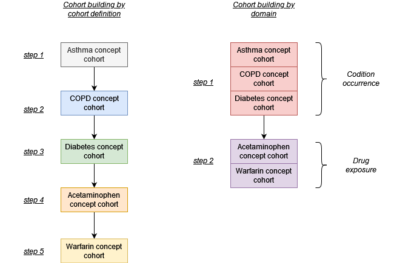

```{r, include = FALSE}
knitr::opts_chunk$set(
  collapse = TRUE,
  comment = "#>"
)
```

## Introduction

The CohortConstructor package is designed to support cohort building pipelines. When using the package the general workflow is to first build a set of base cohorts and then subsequently apply inclusion criteria to derive the final study cohorts of interest. Base cohorts are built by domain (rather than by cohort definition) and from one base cohort many study cohorts can be derived.

## Building a cohort set by domain

Let´s say we want to build 5 cohorts with 3 (asthma, copd, and diabetes) defined based on concepts seen in the condition occurrence table while the other 2 (acetaminophen and warfarin) are based on concepts recorded in the drug exposure table. We can build these cohorts independently, one after the other. However, this approach will mean repeated 3 joins to the condition occurrence tables and 2 joins to the drug exposure table. To make this less computationally expensive, we could instead create the cohorts by domain. In this case we will instead make one join with the condition occurrence table and one to the drug exposure.



## Deriving study cohorts from base cohorts

When making study cohorts we often have a concept sets to define a clinical event along with various study-specific inclusion criteria, for example criteria around an amount of prior observation and age. Often we may have sensitivity analysis where the concept set remains the same but these inclusion criteria change. In such situations we can make cohorts one-by-one. However, this can lead to duplication as we can see in the example below we identify asthma records multiple times. An alternative approach is to build a base cohort, in this case based on asthma records, after which we derive multiple cohorts from this where the different inclusion criteria are each applied.


